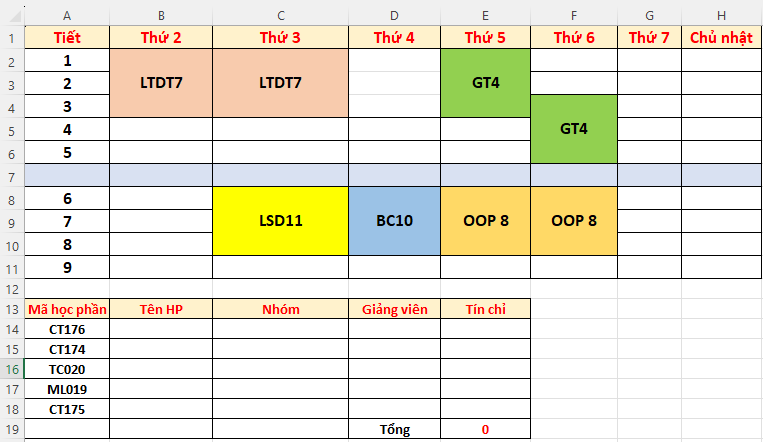

# 🚀 CTU Scheduler
Ứng dụng hỗ trợ các bạn sinh viên **Đại học Cần Thơ** trong việc xếp thời khóa biểu trước và trong khi đăng ký học phần!
## 🏞️ Tổng quan
* Bạn cảm thấy việc sắp xếp thời khóa biểu một cách truyền thống dùng Excel quá tốn thời gian?
* Bạn muốn biết được sĩ số của nhiều nhóm học phần mà không cần phải kiểm tra từng môn?

🠊  Ứng dụng này sẽ giúp được những vấn đề của bạn 🎉

## ✨ Tính năng
* **Tìm và Lưu các nhóm học phần** mà các bạn muốn học từ hệ thống quản lý CTU
* **Sắp xếp thời khóa biểu** chỉ bằng nút click chuột! (Dựa trên các nhóm học phần bạn đã lưu)
* **Cập nhật lại sĩ số** các nhóm học phần bằng **một click!**
> Lưu ý: App chỉ hoạt động với đầy đủ tính năng khi kết nối Internet ổn định
#### 🛠️ Tính năng có thể sẽ được phát triển trong tương lai
* **Xuất thời khóa biểu** dưới định dạng hình ảnh
* **Xuất thời khóa biểu** dưới dạng Excel
* **Tự động đăng ký học phần** theo thời khóa biểu đã soạn

## 📌 Trước khi sử dụng
* Phần mềm chỉ hoạt động trên **hệ điều hành Windows**.
* Để có thể sử dụng được ứng dụng, **bạn phải đăng nhập bằng tài khoản hệ thống quản lý** của mình. Bởi vì ta chỉ có thể lưu và cập nhật các nhóm học phần khi đã đăng nhập
* Nếu **trong quá trình sử dụng mà bị văng đột ngột**, có thể bạn thiếu `.NET runtime`. Bạn có thể vào [.NET Desktop Runtime](https://dotnet.microsoft.com/en-us/download/dotnet/thank-you/runtime-desktop-8.0.18-windows-x64-installer) để tải và cài đặt!
## 🚀 Cài đặt và sử dụng
1.  Tải xuống file nén `.rar` mới nhất [Tại đây](https://github.com/d3nhatv0lam/CTUschedule/releases) 📦.
2. Giải nén file `.rar` đã tải về  📂.
3. Mở thư mục đã giải nén , tìm và mở `CTUschedule.exe`.
4. Trải nghiệm 🎉.
## Demo ứng dụng
* Demo chức năng sản phẩm: [Demo sản phẩm](https://youtu.be/WGhXLnUdkPA)
* Demo cập nhật sĩ số học phần: [Cập nhật sĩ số học phần](https://youtu.be/FmY7GeEiG3c)

## 📧 Liên hệ
* [Facebook - D3n Page](https://www.facebook.com/profile.php?id=100088452777261)
* [Youtube - Dương Đức](https://www.youtube.com/@ucduong9984)
Bạn có thể ủng hộ mình gói mì hehe~~ Love u <3

---
# 🚀 CTU Schedule Helper (English)
**`I will add later...`**